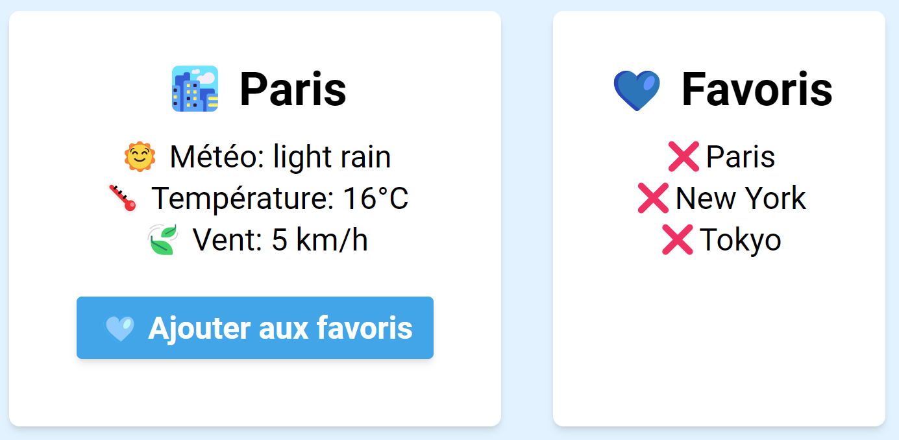

# Aunt May 🌞

(**In progress**, still working on it...)

# The application 📱

Welcome to Aunt May - Your new favorite weather app!

## Overview 🔬

# Launch project 🚀

- Clone the repo, and enter in it.

- `npm install` in the root directory to install dependancies.

- Create an `.env` file following the `.env.sample` file patttern.

- `npm run dev` in the root directory. Enjoy!

# Tools 🛠️ 🪛 🪚

- [Vite](https://www.npmjs.com/package/vite)
- [Axios](https://www.npmjs.com/package/axios)
- [React-geolocated](https://www.npmjs.com/package/react-geolocated)
- [Tailwind](https://www.npmjs.com/package/tailwindcss)
- [Prop-Types](https://www.npmjs.com/package/prop-types)

## Contributing 🛟

If you'd like to contribute to *Aunt May*, feel free to submit a pull request. I welcome your ideas and enhancements!

## License 🚨

This project is licensed under the [MIT License](https://choosealicense.com/licenses/mit/).
